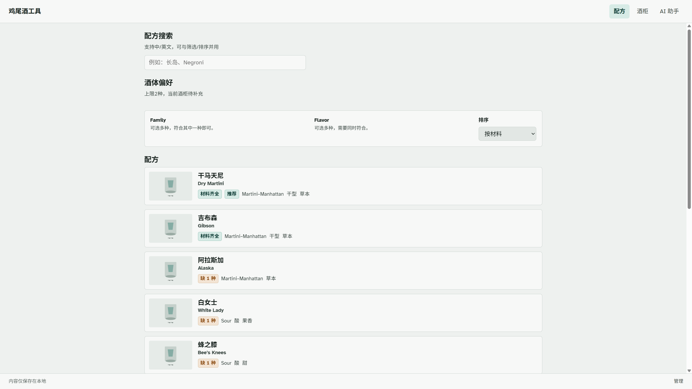
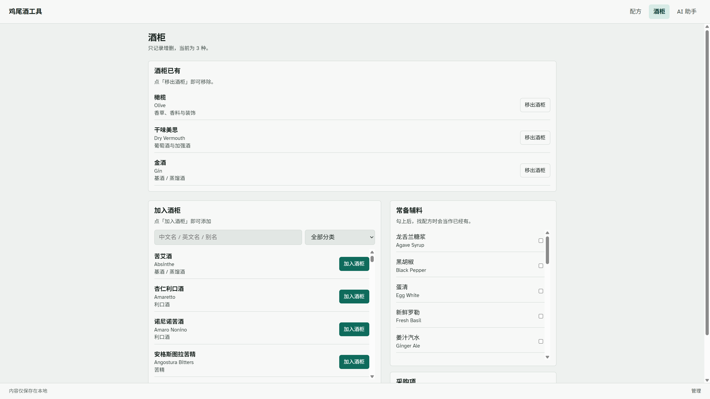
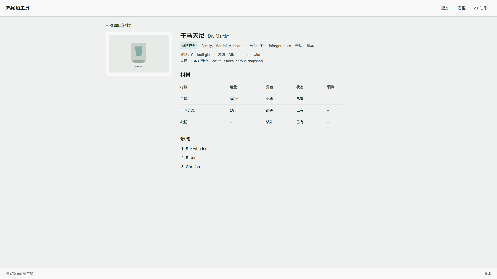

# 本地鸡尾酒配方工具

一款运行在 Windows 本机的单人鸡尾酒配方工具。它会根据酒柜判断材料是否齐全，支持从酒类、Family、Flavor 或配方名开始查找，并把缺少的材料加入采购清单。

数据只保存在本地 SQLite；除可选的 AI 功能外，配方搜索、酒柜和内容后台都不依赖外部服务。

## 页面预览

### 配方搜索

支持中英文名称、酒体偏好、Family、Flavor 与排序。结果优先展示材料齐全的配方，并明确标出缺料数量。



### 酒柜与采购

酒柜只记录材料的增删，不记录余量。常备辅料单独勾选；配方缺料可以加入采购，购买后直接进入酒柜。



### 配方详情

详情页展示杯具、装饰、来源、材料状态与步骤；缺少的材料可逐项加入采购清单。



## 已实现功能

- 配方中英文名称搜索，筛选条件保留在 URL 中。
- 最多选择两种酒类；选择两种时，配方必须同时包含两类酒。
- Family 多选取其一，Flavor 多选需同时满足。
- 按材料齐全程度、名称或随机排序。
- 根据酒柜与常备辅料计算「材料齐全 / 缺 n 种」。
- 结果不足时，用最多缺 2 种材料的配方补足；名称搜索仍可显示深度缺料的准确命中。
- 酒柜材料搜索支持中文名、英文名和维护过的别名。
- 缺料加入采购、移除采购、购买后自动入柜。
- 本机口令保护的内容后台：配方、材料、Family、Flavor、发布状态和首页推荐。
- 后台可标记常备辅料；常备辅料不会重复出现在「加入酒柜」列表。
- IBA 本地语料、材料层级、单位换算、导入与数据验收脚本。

## AI 功能（可选）

AI 只承担自然语言理解与草稿辅助，不替代确定性的配方匹配和库存计算。

- **前台 AI 助手**：输入酒名、酒类或风味；优先匹配现有配方，最多返回 6 条。没有库内结果时才临时生成文本配方，且不允许保存。
- **后台原文导入**：粘贴已有中文或英文酒谱，解析为可编辑草稿；材料先按标准名和别名匹配，未命中时才给 AI 候选，人工确认后才能保存。
- **会话范围**：聊天只保留在当前浏览器标签页，关闭后清空，不写入 SQLite。
- **降级方式**：未配置 Key 或断网时，AI 入口不可用；其他功能不受影响。

项目不使用向量数据库或完整 RAG，也不做 OCR、识图或临时配方一键入库。

## 快速开始

### 环境要求

- Windows 10 / 11
- Node.js **22 LTS**（推荐；Node 24+ 可能缺少 `better-sqlite3` 预编译包）
- pnpm 9
- Chrome 或 Edge

安装 pnpm：

```powershell
npm install -g pnpm@9
```

如果系统 Node 不是 22，可使用仓库内的 Node：

```powershell
$env:PATH = "$PWD\.tools\node;$env:PATH"
node -v
```

### 首次启动

在仓库根目录执行：

```powershell
Copy-Item .env.example .env

pnpm install
pnpm db:migrate
pnpm db:seed
pnpm dev
```

打开 <http://localhost:5173>。

> `pnpm db:seed` 会重建种子数据，并清空酒柜和采购清单。日常启动不要重复执行。

### 日常启动

```powershell
pnpm dev
```

开发模式同时启动：

- 前端：<http://localhost:5173>
- API：<http://localhost:8787>
- 健康检查：<http://localhost:8787/api/health>

服务端由 `tsx watch` 监听改动。如果接口仍表现为旧版本，停止进程后重新运行 `pnpm dev`。

### 本机一体运行

```powershell
pnpm start
```

该命令先构建前端，再由 API 进程同时提供静态页面和接口。默认访问 <http://localhost:8787>。

## 配置

复制 `.env.example` 后按需修改：

```dotenv
PORT=8787
DATABASE_URL=./data/app.sqlite
ADMIN_PASSWORD=cocktail-admin
AI_BASE_URL=https://api.siliconflow.cn/v1
AI_API_KEY=
AI_MODEL=deepseek-ai/DeepSeek-V3
```

- `PORT`：一体运行时的服务端口。
- `DATABASE_URL`：SQLite 文件位置。
- `ADMIN_PASSWORD`：内容后台口令；默认值只适合本机开发。
- `AI_BASE_URL`：OpenAI 兼容服务地址。
- `AI_API_KEY`：只在服务端读取，切勿提交。
- `AI_MODEL`：模型名称；示例配置使用 `DeepSeek-V3`，不填写时服务端回退到 `DeepSeek-V4-Flash`。

`.env` 和 `data/app.sqlite` 已被 Git 忽略。复制 `data/app.sqlite` 可作为手工备份，但产品目前没有导入导出界面。

## 常用入口

- `/`：配方搜索与筛选
- `/recipes/:id`：配方详情
- `/bar`：酒柜、常备辅料和采购清单
- `/ai`：AI 助手
- `/admin/login`：内容后台
- `/admin/recipes/import`：从原文导入配方

开发环境默认后台口令为 `cocktail-admin`；请以本机 `.env` 为准。

## 常用命令

```powershell
pnpm dev          # API + Vite 开发服务
pnpm start        # 构建前端并由 API 一体托管
pnpm test         # shared + domain + server 测试
pnpm db:migrate   # 执行 Drizzle 迁移
pnpm db:seed      # 重建种子数据；会清空酒柜和采购
pnpm db:accept    # 检查本地语料与数据约束
```

前端构建或单包测试：

```powershell
pnpm --filter @cocktail/web build
pnpm --filter @cocktail/domain test
pnpm --filter @cocktail/server test
```

## 技术栈

- **前端**：React 19、React Router、Vite、TypeScript、CSS Modules
- **API**：Hono、Zod、TypeScript、tsx
- **数据**：SQLite、better-sqlite3、Drizzle ORM
- **测试**：Vitest
- **AI**：可替换的 OpenAI 兼容 Provider
- **工作区**：pnpm monorepo

## 目录结构

```text
apps/
  web/                 React 用户前台与内容后台
  server/              Hono API、AI 编排与业务服务
packages/
  domain/              匹配、缺料、补足、排序与推荐规则
  db/                  SQLite schema、迁移、seed 与数据验收
  shared/              API schema 与共享类型
data/
  iba/                  本地配方、材料与分类语料
docs/
  PRD.md                产品需求
  TECH_SPEC.md          技术规格
  AI_ASSISTANT.md       AI 边界与流程
  ACCEPTANCE.md         验收记录与复现步骤
```

## 设计边界

这是本地、单人、桌面端工具。首版不包含多用户、公网部署、云同步、手机端适配、库存余量、替代材料、收藏历史、社区、OCR、条码、真实成品图抓取或前台投稿。

## 项目状态

当前已知限制和可复现验收步骤见：

- [产品需求](docs/PRD.md)
- [技术规格](docs/TECH_SPEC.md)
- [AI 助手说明](docs/AI_ASSISTANT.md)
- [验收记录](docs/ACCEPTANCE.md)
